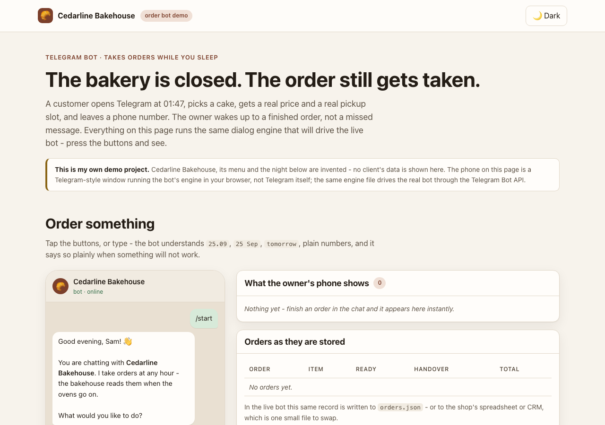
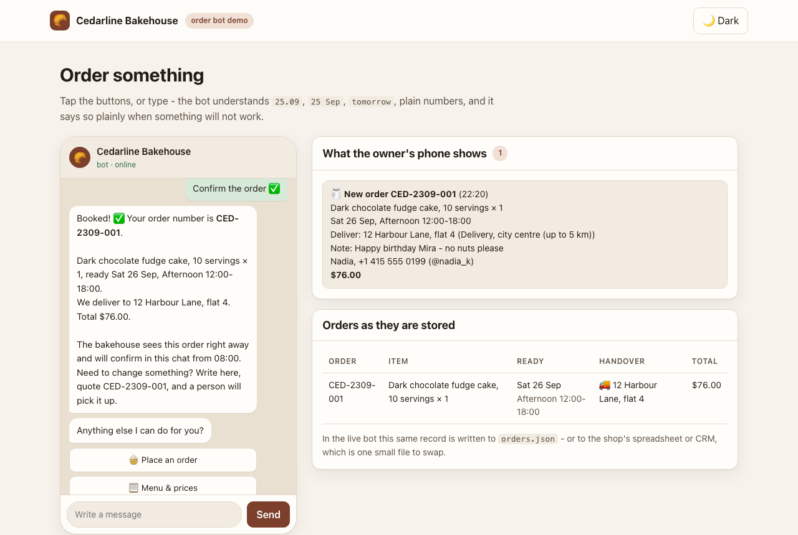
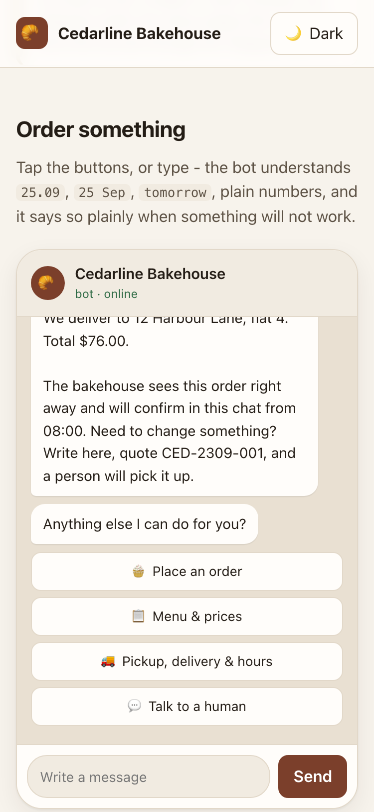

# Cedarline Bakehouse: Telegram order bot (demo)

A Telegram bot that takes a whole order on its own: shows the menu, collects the details,
checks the date against how long the item needs, prices it, confirms it, stores it, and
pings the owner's phone. It works at 2 a.m., and it hands over to a human when a human is needed.

**Cedarline Bakehouse is an invented shop.** This is a demo on made-up data: the menu, the customers
and the "night" in the demo page are written for it. No client's data appears anywhere.

- Live demo: https://flowlab-dev.github.io/demo/telegram-orders/
- Case studies: https://flowlab-dev.github.io/work/telegram-orders/ and https://flowlab-dev.github.io/work/whatsapp-bot/

Built by Flow Lab with Claude Code. Every change is checked by the tests below before it ships.



| Order confirmed | On a phone |
|---|---|
|  |  |

---

## See it without installing anything

Open **`demo/index.html`** by double-clicking it. No internet, no keys, no build step.

- Order something in the phone window on the left. The buttons and the typing both work.
- Watch the owner's panel on the right fill up the moment an order is confirmed.
- Press **Run the night** to replay eleven customers between 22:05 and 04:58.
  Every number on that page is counted while you watch, by the same engine the live bot runs.

---

## What the bot does

| | |
|---|---|
| **Takes the order** | category → item → size → quantity → day → time window → pickup or delivery → address → notes → name → phone → confirmation |
| **Knows the shop's rules** | 48 h for cakes, 24 h for platters, 12 h for bread; closed Mondays; delivery zones and fees; a minimum basket for delivery; orders up to 60 days ahead |
| **Prices it** | live total with the delivery fee, shown before the customer confirms |
| **Understands typing** | `25.09`, `25 Sep`, `Sep 25`, `2026-09-25`, `tomorrow`, plain numbers, day first as the prompt says, and it explains clearly when a date will not work |
| **Lets people change their mind** | Back on every step, "Change something" on the summary, `/cancel` at any point |
| **Hands over to a human** | "Talk to a human" forwards the question to the owner and says so honestly |
| **Tells the owner** | every order arrives on the owner's phone immediately, plus one summary at opening time |

## Running the real bot

You need [Node.js 20 or newer](https://nodejs.org). No packages are installed: the bot
uses only what Node itself provides.

1. **Create the bot.** In Telegram, write to `@BotFather`, send `/newbot`, follow the two
   questions, and copy the token it gives you. It looks like `1234567890:AA...`.
2. **Find your chat id** so the bot can notify you: write to `@userinfobot`, it replies with your id.
3. **Fill in the settings.**
   ```
   cp .env.example .env
   ```
   Open `.env` and paste the token and the chat id.
4. **Start it.**
   ```
   npm start
   ```
   Write `/start` to your bot in Telegram. Stop it with Ctrl+C.

`.env` is never committed, so the token stays on the machine that runs the bot.

### Where orders go

By default every order is written to `storage/orders.json`, together with the chat sessions.
That file holds customers' names, phones and addresses, so it is excluded from the repository.

To send orders somewhere else (a Google Sheet, Airtable, a CRM, an email), replace
`bot/storage.js`. The dialog only calls `addOrder()` and `nextSequence()`, so nothing else has to change.

The file is rewritten on every update and chat sessions are kept indefinitely, which is
comfortable into the low thousands of orders, the size a single bakery reaches in a year or two.
Past that, or if the shop wants reporting, the same two methods point at a database instead.

### Keeping it running

`npm start` runs in the foreground. On a server, run it under a supervisor that restarts it
(`systemd`, `pm2`, or a Docker restart policy), so a reboot or a crash brings it back.
The bot uses long polling, which needs no domain and no certificate. If the shop ever
outgrows that (thousands of messages an hour), a webhook is a small change in `bot/run.js`.

---

## How it is built

```
engine/     the dialog: pure functions, no network, no clock of their own
  catalog.js    menu, prices, lead times, delivery zones   <- the file the owner edits
  text.js       every sentence the bot says
  dialog.js     the state machine: (state, event) -> (state, actions)
  validate.js   dates, phones, names, addresses, quantities
  pricing.js    totals in whole cents
  orders.js     the stored order record
  harness.js    runs the dialog in memory (used by the demo page and the tests)
bot/        the live bot: long polling, retries, storage, logging
demo/       the offline demo page and the script that inlines the engine into it
tests/      the checks, run with: npm test
```

The engine never talks to Telegram and never reads the clock: the caller passes the time in.
That is why the same file can drive the live bot, the browser demo and the tests, and why
the tests can replay a whole night in milliseconds.

### Built for the night shift

- **No order is taken twice.** Telegram re-sends an update when an answer is lost; every update
  id is remembered, and a repeat is ignored.
- **Network trouble is survived.** Rate limits and dropped connections are retried with growing
  pauses; a wrong token stops the bot with a clear message instead of looping.
- **Old buttons cannot corrupt an order.** A button tapped from a message further up the chat is
  recognised and answered politely.
- **Nothing is confirmed before it is saved.** The order is written to storage, then the customer
  is told "booked", then the owner is notified.
- **The slot is re-checked at the last moment.** If a summary sat open on someone's phone until the
  date passed, the bot says so instead of booking the impossible.

### Tests

```
npm test
```

64 checks: the whole order path, every refusal with its reason, back and cancel, editing at the
summary, escaping of anything a customer types, retries and rate limits, storage after a corrupted
file, the morning summary, and a parity check that the engine inlined in the demo page is the
engine in `engine/`, byte for byte and in behaviour.

After changing anything in `engine/`, run:

```
npm run build:demo
```

---

## Monthly support

The menu changes, the prices change, and Telegram changes, so the bot needs looking after. What a
monthly agreement covers:

- menu, prices, lead times and delivery zones updated whenever the shop changes them;
- the bot watched, so a silent failure is noticed before the customers notice it;
- Telegram API changes handled before they break anything;
- small additions as the shop learns what people ask for;
- a monthly note: how many orders came in and where people dropped out;
- backups of the order file and export to whatever the shop uses for bookkeeping.

---

## WhatsApp: the same bot, a second channel

`whatsapp/` connects the **same engine** to the WhatsApp Cloud API (Meta). Nothing in the order logic changes;
only the way messages are shown does:

| Engine | WhatsApp |
|---|---|
| up to 3 buttons, short titles | reply buttons |
| 4–10 buttons | a list menu ("Choose"), long labels split into title + description |
| more than 10 | a numbered menu: typing "3" works like tapping the third option |
| **bold**, _italic_ (HTML) | `*bold*`, `_italic_` |
| "Hi", "Hello", "Привет" | opens the menu (WhatsApp chats start with a greeting, not /start) |

Safety: the `X-Hub-Signature-256` of every webhook call is checked with the app secret; Meta's repeated
deliveries are answered once; photos and voice notes get a plain answer. Sending retries on 429/5xx and stops on
a wrong token or number.

**Whose account:** the WhatsApp Business account, the phone number and the Meta app belong to the **client** (their Meta Business); we connect the bot to their number with the access they give us.

**Run it:** fill the `WA_…` lines in `.env` (Meta app → WhatsApp → API setup), start `node whatsapp/server.js`,
and set the webhook URL `https://<your-server>/webhook` with the same verify token in the Meta app.
Messages the business starts itself (for example, to the owner) need an approved template outside the 24-hour window.

**Tested without a Meta account:** `tests/whatsapp.test.js` runs a whole order through the webhook against a fake
Cloud API and checks every message against WhatsApp's limits (`npm test` runs 69 checks in total).

## The same bot for your shop

Write to trading.flowlab@gmail.com or @flowlabdev on Telegram with your menu and how you take orders now. I will tell you what it takes and whether a smaller first version would do.

## License

MIT
